# LanPro — Dokumen Gabungan BRD · FSD · TSD

| Meta                  | Nilai                                                                                                             |
| --------------------- | ----------------------------------------------------------------------------------------------------------------- |
| **Produk**            | LanPro — manajemen proyek + kolaborasi (Issue, Sprint/Milestone, Kanban, QA, Wiki, Flowchart, Meeting AI)         |
| **Versi dokumen**     | **3.1.0** (06 Sep 2026)                                                                                           |
| **Status**            | **DRAFT review pemilik** — selaras kode + `AUDIT.md` §19 + papan 7 BELUM · 455 SELESAI (**#466** SELESAI dokumen) |
| **Tiket papan**       | **#466** — dokumentasi BRD/FSD/TSD lengkap (per modul, Meeting AI, OIDC, flowchart)                               |
| **Keputusan pemilik** | (1) setujui #466 · (2) flowchart **per modul** · (3) PDF · (4) alur Meeting AI + detail bisnis/teknis             |
| **Sumber RBAC**       | `src/lib/matriksAkses.ts` ↔ `AUDIT.md` §19.4 / §19.5                                                              |
| **Metodologi**        | Dual-mode Agile / Waterfall (#311, #312, #465)                                                                    |
| **Bahasa**            | Indonesia (istilah teknis EN dipertahankan)                                                                       |

> v2.5 diganti (RBAC basi). v3.0 = kerangka. **v3.1** = detail per modul + Meeting AI + Auth/OIDC + swimlane.

---

## Daftar isi

1. [BRD — Business Requirements](#1-brd--business-requirements)
2. [FSD — Functional Specification (ringkas lintas modul)](#2-fsd--functional-specification)
3. [TSD — Technical Specification](#3-tsd--technical-specification)
4. [Flowchart — Alur sistem LanPro](#4-flowchart--alur-sistem-lanpro)
5. [Flowchart — Agile vs Waterfall](#5-flowchart--agile-vs-waterfall)
6. [Flowchart — Per peran sistem](#6-flowchart--per-peran-sistem)
7. [Flowchart — Per peran proyek](#7-flowchart--per-peran-proyek)
8. [Matriks akses](#8-matriks-akses)
9. [**Spesifikasi per modul (BRD+FSD+TSD+flow)**](#9-spesifikasi-per-modul)
10. [**Meeting AI — spesifikasi dalam**](#10-meeting-ai--spesifikasi-dalam)
11. [**Auth & OIDC — spesifikasi dalam**](#11-auth--oidc--spesifikasi-dalam)
12. [Lampiran](#12-lampiran)

---

# 1. BRD — Business Requirements

## 1.1 Masalah bisnis

Organisasi engineering sering memakai **4–6 tool terpisah** (tracker, board, dokumen, QA spreadsheet, notulen, diagram). Akibatnya:

1. Silo requirement ↔ development ↔ QA ↔ notulen.
2. Hak akses tidak seragam (risiko IDOR / over-permission).
3. Master data (status, peran, departemen) tidak kanonik — label vs code bercampur.
4. Metodologi **Agile** dan **Waterfall** dicampur tanpa aturan navigasi yang jernih.
5. Notulen rapat tidak otomatis menjadi poin diskusi / kandidat isu.

## 1.2 Solusi produk (posisi resmi §24.2 / #346)

LanPro = **pelacak agile-first** (backlog, sprint, kanban, poin, burndown) **plus** Gantt/milestone, wiki, rapat AI, QA, flowchart — **bukan** hibrida Jira + MS Project penuh.

| Metodologi    | Perilaku produk                                                                    |
| ------------- | ---------------------------------------------------------------------------------- |
| **Agile**     | Menu Planning & Sprint; scope lock; satu sprint aktif; burndown hybrid poin\|tugas |
| **Waterfall** | Menu Sprint **disembunyikan**; Roadmap & Milestones; create sprint API ditolak     |

**Ditolak secara produk (#346):** CPM/critical path, WBS penuh, timesheet kapasitas, marketplace automation Jira-class.

## 1.3 Tujuan & KPI

| Tujuan                   | KPI                                   | Status / catatan                              |
| ------------------------ | ------------------------------------- | --------------------------------------------- |
| Satu workspace SDLC      | Modul inti dipakai 1 org              | Issues + Sprint/Roadmap + Meeting + Wiki + QA |
| Keamanan deny-by-default | 0 rute proyek tanpa `jagaProyek`      | Two-Tier RBAC F7                              |
| Dual-mode bersih         | Copy Sprint ≠ Phase; nav berubah      | #465 SELESAI kode                             |
| Meeting → insight        | Pipeline sampai COMPLETED             | #320 BELUM E2E pemilik                        |
| Durabilitas unggahan     | Storage bukan ephemeral di production | #30 terbuka                                   |

## 1.4 Pemangku kepentingan & persona

### Tier A — Peran sistem (`Users.role`)

| Code     | Label             | Tanggung jawab bisnis                                                        |
| -------- | ----------------- | ---------------------------------------------------------------------------- |
| `admin`  | Administrator     | Onboarding user, master data, audit, buat proyek, **God Mode** lintas proyek |
| `head`   | Department Head   | Baca admin terbatas; daftar proyek se-departemen                             |
| `user`   | Standard User     | Anggota proyek sesuai `ProjectMembers`                                       |
| `viewer` | Observer (sistem) | Baca terbatas di lingkup sistem                                              |

### Tier B — Peran proyek (`ProjectMembers.role`)

| Code               | Label                    | Wilayah kuasa bisnis                            |
| ------------------ | ------------------------ | ----------------------------------------------- |
| `owner`            | Project Owner            | Pemilik; hapus proyek; setelan                  |
| `admin`            | Project Admin            | Administrasi proyek (**bukan** God Mode sistem) |
| `manager`          | Project Manager          | Perencanaan, isu, board, sprint/timeline        |
| `head`             | Department Head (proyek) | Baca seluruh modul proyek                       |
| `system_analyst`   | System Analyst           | **CRUD** Wiki + Flowchart                       |
| `business_analyst` | Business Analyst         | **CRUD** Meeting Notes + AI                     |
| `developer`        | Developer                | CRU isu; RU board/QA                            |
| `qa`               | QA                       | **CRUD** modul QA; taut bug → Task              |
| `viewer`           | Viewer (proyek)          | Baca saja                                       |

## 1.5 Ruang lingkup

**In scope:** auth (email/OIDC), proyek, isu/task, sprint/milestone, kanban, roadmap/Gantt, QA, wiki, flowchart, meeting (+ AI pipeline), tim/akses, master data, audit, dual-mode, RBAC dua tingkat.

**Out of scope:** CPM, WBS penuh, timesheet, marketplace automation, parity Otter.ai penuh (diarization speaker masih gap #320).

## 1.6 Asumsi, risiko, ketergantungan

| Item                    | Risiko / asumsi                              | Tiket      |
| ----------------------- | -------------------------------------------- | ---------- |
| Storage local di Vercel | File ephemeral                               | #30 · #290 |
| Meeting recording lokal | Tidak memakai `STORAGE_DRIVER` S3            | #30 · #320 |
| Bukti visual tab bersih | Gerbang ≠ bukti UI                           | #335       |
| Meeting AI COMPLETED    | Butuh Gemini + ffmpeg + E2E pemilik          | #320       |
| SSO Microsoft lapangan  | Adaptor ada; verifikasi domain               | #305       |
| Soft-delete             | **Ditolak** — hanya hard-delete + konfirmasi | #394       |

## 1.7 Aturan bisnis lintas-produk (katalog BR-*)

| ID         | Aturan                                                                      | Referensi       |
| ---------- | --------------------------------------------------------------------------- | --------------- |
| BR-RBAC-01 | Deny-by-default; God Mode hanya `Users.role=admin` + audit                  | §19.6           |
| BR-METH-01 | Waterfall: POST sprint ditolak; menu Sprint disembunyikan                   | #311 #465       |
| BR-SPR-01  | Lingkup sprint aktif/selesai terkunci kecuali `unlockScope`                 | #461            |
| BR-SPR-02  | Maksimal satu sprint `active` per proyek                                    | #462            |
| BR-MET-01  | Burndown: poin bila totalPoints>0 else hitungan tugas                       | #464            |
| BR-QA-01   | Bug QA: `linkedTaskId` + `linkedBugKey` tampilan                            | #463            |
| BR-DEL-01  | Soft-delete ditolak; hard-delete + konfirmasi + cascade                     | #394 #444       |
| BR-IRIS-01 | Tidak membangun CPM/timesheet marketplace                                   | #346            |
| BR-MD-01   | Yang disimpan ke DB adalah **code** MasterData, bukan label                 | AGENTS.md       |
| BR-MEET-01 | Rekaman hanya untuk analisis; hapus file setelah COMPLETED                  | #320            |
| BR-MEET-02 | PUT/DELETE meeting: author **atau** system ADMIN (lebih ketat dari matriks) | meetings.routes |

---

# 2. FSD — Functional Specification

## 2.1 Modul fungsional (sidebar)

| Modul UI                               | Key matriks    | Fungsi utama                                 |
| -------------------------------------- | -------------- | -------------------------------------------- |
| Dashboard                              | `dashboard`    | KPI, burndown/velocity (Agile), ringkasan    |
| Daftar Isu                             | `list`         | CRUD isu, History, lampiran, komentar        |
| Perencanaan & Sprint                   | `sprints`      | Backlog ↔ sprint, start/complete, scope lock |
| Papan Kanban                           | `board`        | DnD status MasterData, WIP lunak             |
| Peta Jalan & Linimasa                  | `timeline`     | Gantt, milestone, garis `blocks`             |
| Penilaian Kualitas                     | `qa`           | Suite/case, eksekusi, bug → Task             |
| Dokumentasi                            | `wiki`         | Dokumen proyek                               |
| Editor Diagram Alur                    | `flowchart`    | Kanvas flowchart                             |
| Catatan Rapat                          | `meetingNotes` | Notulen + Meeting AI                         |
| Tim                                    | `access`       | Anggota & peran proyek                       |
| Master / Users / Audit / DB / Settings | modul sistem   | Administrasi                                 |

Detail per modul: **§9**. Meeting AI: **§10**. Auth: **§11**.

## 2.2 Persyaratan non-fungsional

- UI token `surface-*` / `content-*` / `border-*` (§22); gerbang `audit:tema` / `audit:warna`.
- i18n ID/EN.
- PostgreSQL saja (Neon pooler); identifier camelCase dikutip.
- JWT di klien (arah httpOnly terkait #30).
- Hard-delete saja (#394).

---

# 3. TSD — Technical Specification

## 3.1 Arsitektur runtime

```text
Browser (React 19 + Vite + Tailwind v4)
        | HTTPS + Socket.IO
Express (server.ts) :3000
        | jagaProyek / verifyGlobalAdmin / JWT
Routes → Controllers/Services → Repositories → PostgreSQL (Neon)
        | optional Redis (Socket.IO adapter)
        | Gemini (Meeting AI) · FFmpeg · local uploads · Resend/SMTP
```

## 3.2 Lapisan penting

| Lapisan        | Path                                          | Catatan                                       |
| -------------- | --------------------------------------------- | --------------------------------------------- |
| Fitur UI       | `src/features/*`                              | Satu folder per domain                        |
| Primif UI      | `src/components/`                             | Stateless lintas fitur                        |
| Matriks RBAC   | `src/lib/matriksAkses.ts`                     | Sinkron AUDIT §19                             |
| Peran          | `src/types/roles.ts`                          | Dua enum SYSTEM/PROJECT                       |
| Metodologi     | `src/lib/methodology.ts`, `alurMetodologi.ts` |                                               |
| Sprint lingkup | `server/lib/sprintLingkup.ts`                 | #461                                          |
| Migrasi        | `src/lib/pg-migrate.ts`                       | **Jangan sentuh `src/lib/db.ts` sembarangan** |
| Penjaga proyek | `server/middleware/jagaProyek.ts`             |                                               |

## 3.3 Alur request otorisasi

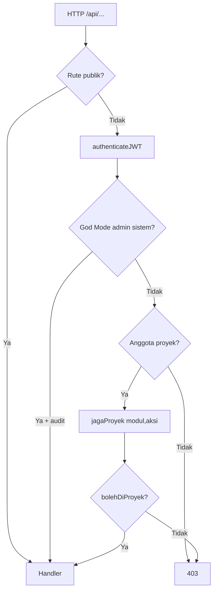

## 3.4 Stack & gerbang

- Dev: `npm run dev` → `tsx watch server.ts`
- Build: Vite FE + esbuild `dist/server.cjs`
- Gerbang: `doctor`, `lint`, `test`, `build`, `audit:papan|warna|tema`
- UI benar = **tab peramban bersih**, bukan hanya build hijau (§15.3)

## 3.5 Integrasi

| Integrasi               | Fungsi                     | Env kunci                           |
| ----------------------- | -------------------------- | ----------------------------------- |
| Neon PostgreSQL         | Data primer                | `DATABASE_URL` (pooler)             |
| Google Gemini           | Meeting AI STT + LLM       | `GEMINI_API_KEY`                    |
| OIDC Google / Microsoft | SSO                        | `OIDC_GOOGLE_*`, `OIDC_MICROSOFT_*` |
| Resend / SMTP           | Email                      | `EMAIL_*` / IntegrationSettings     |
| FFmpeg                  | Transcode rekaman          | binary di PATH                      |
| Storage local           | Unggahan + rekaman meeting | `uploads/` (meeting **belum** S3)   |

---

# 4. Flowchart — Alur sistem LanPro

## 4.1 Peta modul end-to-end

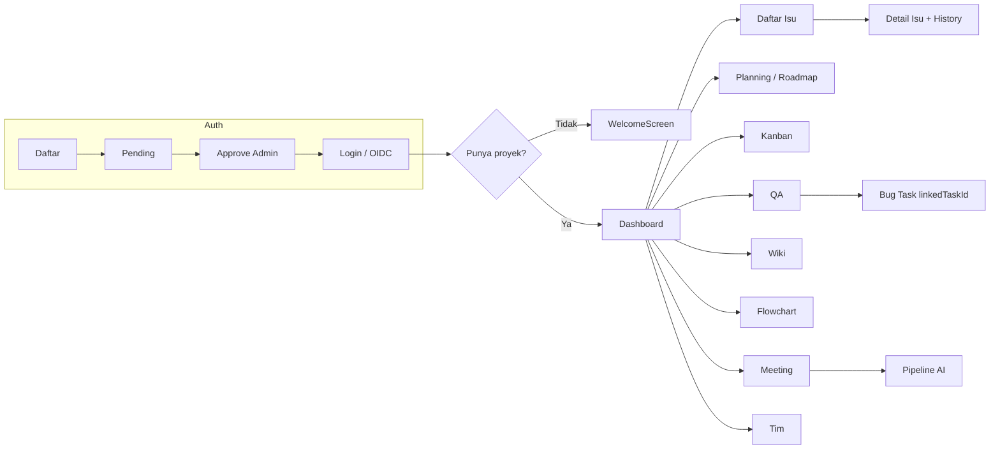

## 4.2 Siklus hidup akun

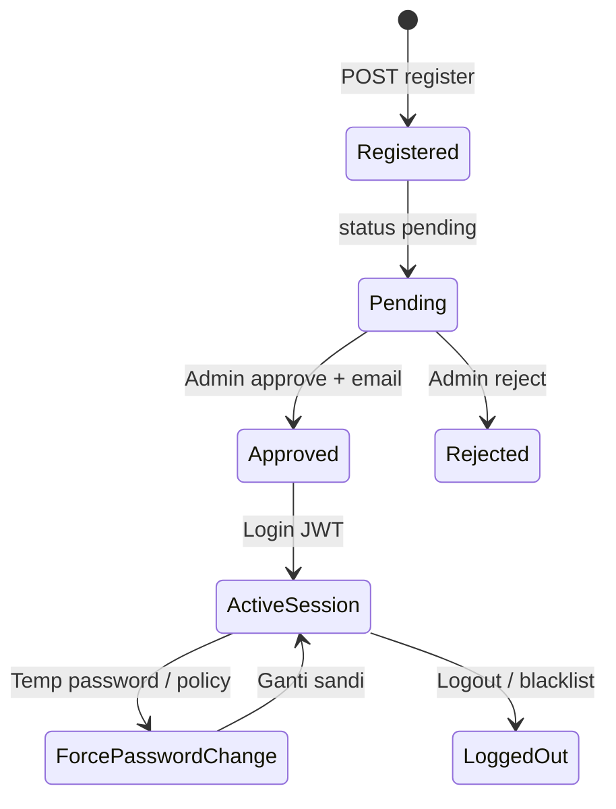

## 4.3 Siklus hidup isu

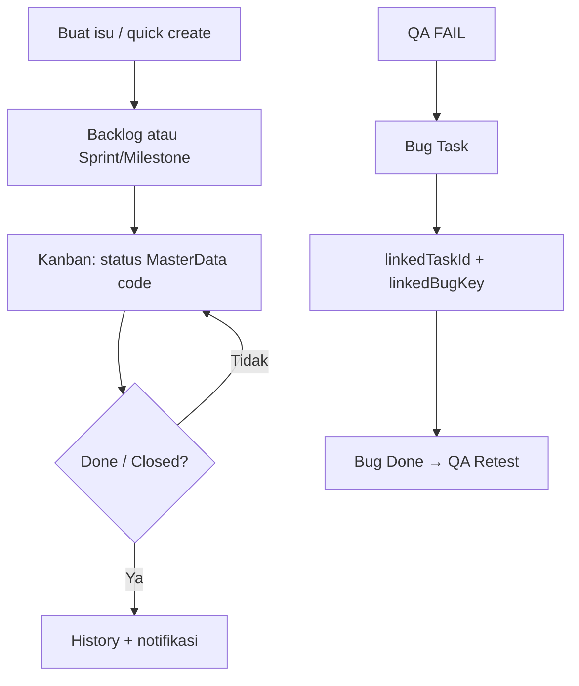

---

# 5. Flowchart — Agile vs Waterfall

## 5.1 Pemilihan metodologi

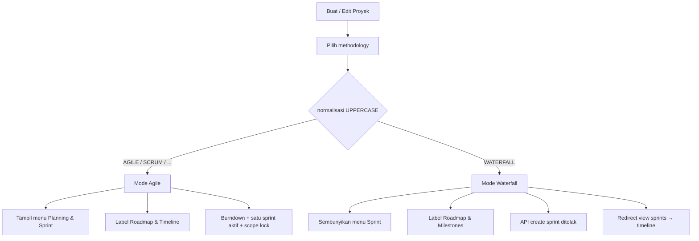

## 5.2 Alur Agile

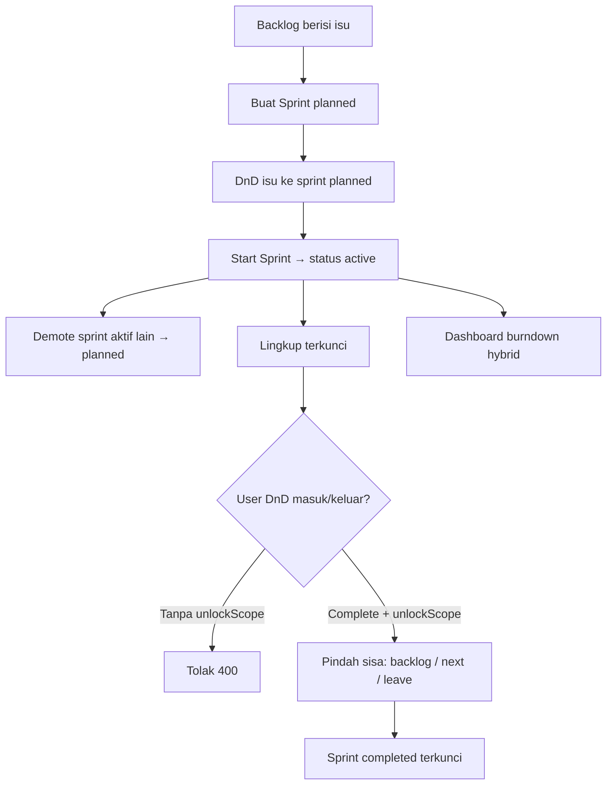

## 5.3 Alur Waterfall

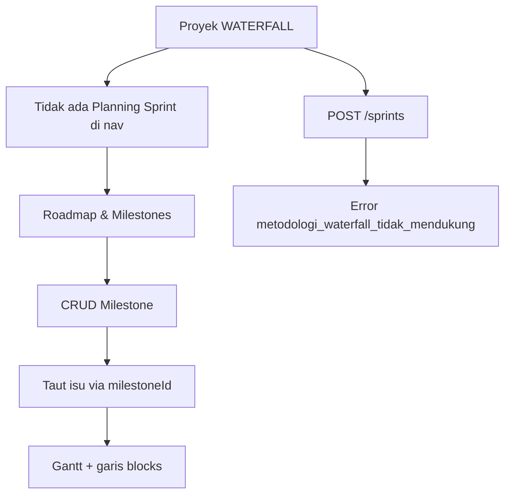

## 5.4 Perbandingan cepat

| Aspek            | Agile LanPro          | Waterfall LanPro  | Jira (kasar)      |
| ---------------- | --------------------- | ----------------- | ----------------- |
| Unit perencanaan | Sprint                | Milestone + Gantt | Sprint / Version  |
| Board            | Kanban status dinamis | Kanban sama       | Board             |
| Scope lock       | Ya (#461)             | N/A               | Sprint incomplete |
| Satu aktif       | Ya (#462)             | N/A               | Umum praktik      |
| CPM / baseline   | Tidak                 | Tidak             | Add-on            |

---

# 6. Flowchart — Per peran sistem

## 6.1 Administrator (`admin`)

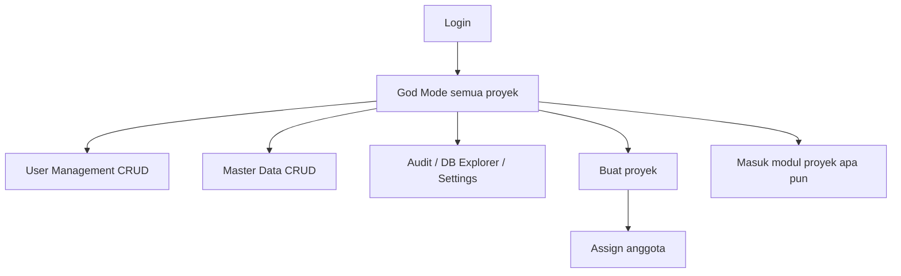

## 6.2 Department Head (`head` sistem)

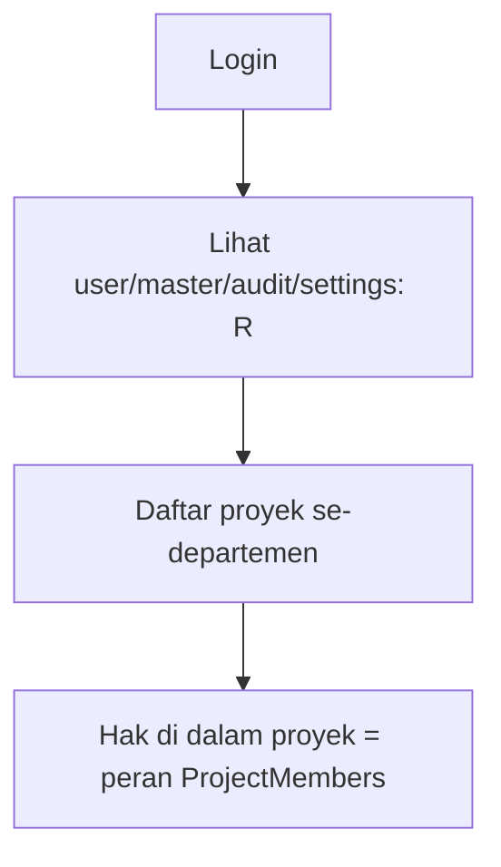

## 6.3 Standard User & Observer sistem

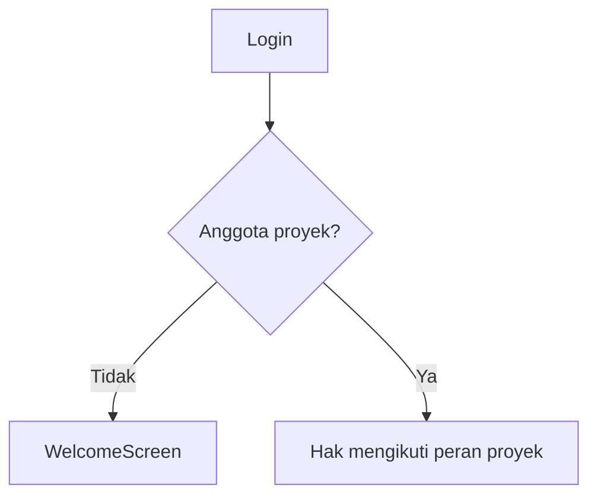

---

# 7. Flowchart — Per peran proyek

## 7.1 Owner / Project Admin / Manager

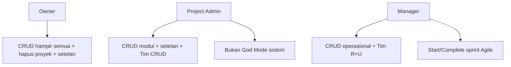

## 7.2 System Analyst / Business Analyst

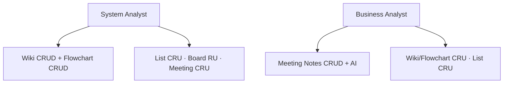

## 7.3 Developer / QA / Head / Viewer

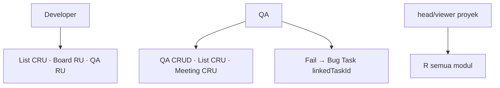

---

# 8. Matriks akses

Sumber: `MATRIKS_PROYEK` / `MATRIKS_SISTEM`. Huruf = C R U D.

### 8.1 Sistem

| Modul          | admin | head | user | viewer |
| -------------- | :---: | :--: | :--: | :----: |
| userManagement | CRUD  |  R   |  —   |   —    |
| masterData     | CRUD  |  R   |  —   |   —    |
| auditLog       | CRUD  |  R   |  —   |   —    |
| dbExplorer     | CRUD  |  —   |  —   |   —    |
| settings       | CRUD  |  R   |  —   |   —    |
| buat proyek    |   C   |  —   |  —   |   —    |

### 8.2 Proyek (cuplikan)

| Modul              | owner/admin/manager | SA       | BA       | developer | qa       | head/viewer |
| ------------------ | ------------------- | -------- | -------- | --------- | -------- | ----------- |
| dashboard          | R                   | R        | R        | R         | R        | R           |
| list               | CRUD*               | CRU      | CRU      | CRU       | CRU      | R           |
| board              | CRUD*               | RU       | RU       | RU        | RU       | R           |
| sprints / timeline | CRUD*               | R        | R        | R         | R        | R           |
| wiki               | CRUD*               | **CRUD** | CRU      | R         | R        | R           |
| flowchart          | CRUD*               | **CRUD** | CRU      | R         | R        | R           |
| meetingNotes       | CRUD*               | CRU      | **CRUD** | R         | CRU      | R           |
| qa                 | CRUD*               | RU       | RU       | RU        | **CRUD** | R           |
| access             | CRUD / RU†          | R        | R        | R         | R        | R           |

\* manager = CRUD operasional sesuai matriks penuh.  
† access: owner/admin CRUD; manager R+U.  
Setelan proyek: owner + project admin. Hapus proyek: owner saja.

---

# 9. Spesifikasi per modul

Setiap subbagian mengikuti pola: **Bisnis → Fungsional → Teknis → Swimlane → Aturan**.

---

## 9.1 Auth & akun

**Bisnis.** Hanya akun **approved/active** yang boleh masuk. Admin menyetujui pendaftar. SSO Google/Microsoft setara password untuk domain yang dikonfigurasi.

**Fungsional.** Register, approve/reject, login, logout, forgot/reset password (kata sandi sementara 2 jam — #448/#451), wajib ganti sandi, lengkapi pendaftaran OIDC.

**Teknis.** `src/features/auth/` · `server/routes/auth.routes.ts` · `auth-oidc.routes.ts` · approve via `user.routes.ts` PUT status. JWT di klien; blacklist saat logout/forgot.

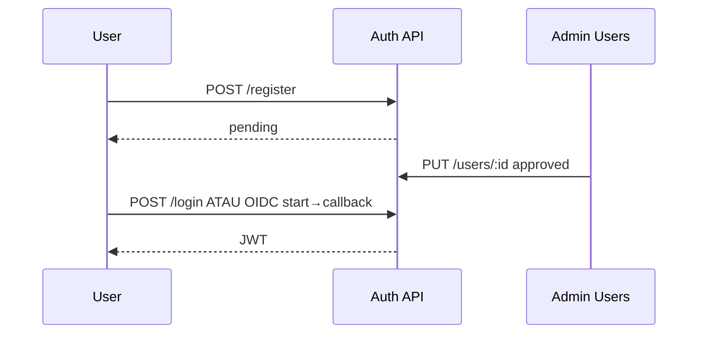

Detail penuh: **§11**.

---

## 9.2 Proyek (buat, setelan, metodologi)

**Bisnis.** Hanya Administrator sistem yang membuat proyek. Owner/Admin proyek mengubah setelan & metodologi. Hapus proyek = hard cascade, owner saja.

**Fungsional.** Create project, set `category`/methodology (code MasterData, UPPERCASE), invite anggota, dashboard layout, delete.

**Teknis.** `server/routes/project.routes.ts` · `project-modules.routes.ts` · UI di `AppContainer` + chrome proyek. `bolehBuatProyek` / `bolehUbahSetelanProyek` / `bolehHapusProyek`.

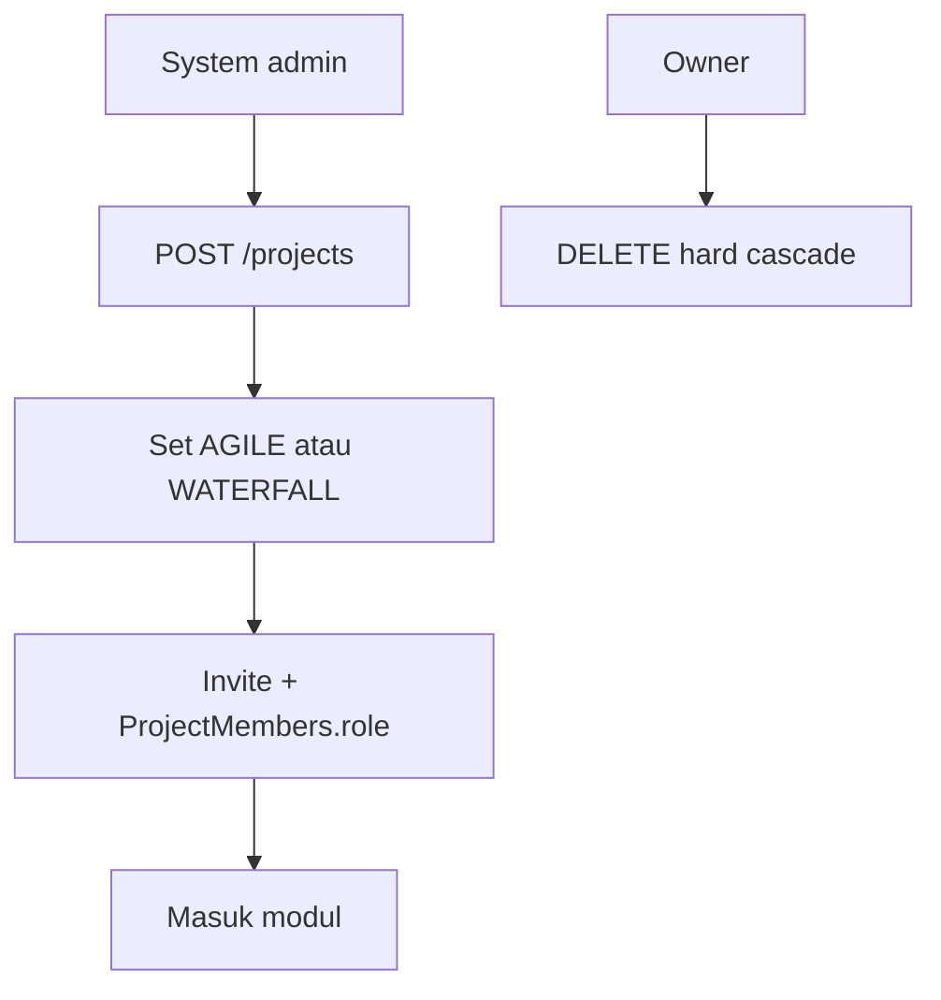

---

## 9.3 Dashboard

**Bisnis.** Ringkasan kesehatan proyek: KPI isu, sprint aktif (Agile), aktivitas.

**Fungsional.** Widget KPI, filter sprint, burndown hybrid (#464), layout tersimpan.

**Teknis.** `src/features/dashboard/` · data agregat dari tasks/sprints/meetings · `PUT .../dashboard-layout` · guard `dashboard` R.

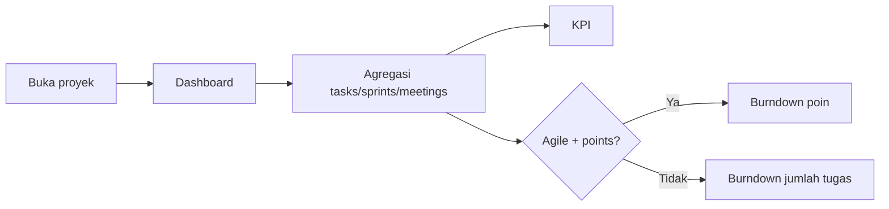

---

## 9.4 Daftar Isu / Task

**Bisnis.** Sumber kebenaran pekerjaan. Status/prioritas/tipe dari MasterData **code**. History field-diff ala Jira (#452/#456). Hapus permanen (#394) + cascade (#444).

**Fungsional.** List, filter, quick create, detail modal, komentar, lampiran, subtask/link, activity history, bulk delete.

**Teknis.** `src/features/issues/` · `server/routes/task.routes.ts` · upload `file.routes.ts` · Soft FK sprint/milestone; scope lock berlaku saat pindah sprint aktif/selesai.

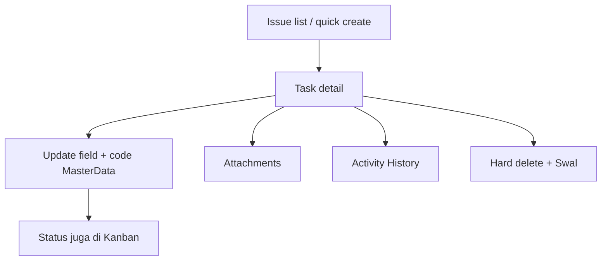

**Swimlane peran (ringkas).**

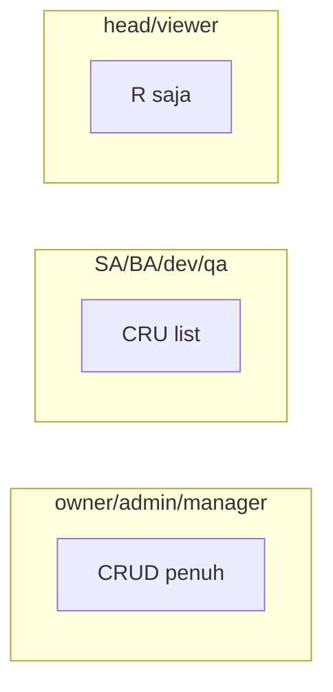

---

## 9.5 Planning & Sprint (Agile)

**Bisnis.** Rencanakan iterasi; setelah start, lingkup terkunci agar burndown bermakna; hanya satu sprint aktif.

**Fungsional.** Backlog, buat sprint planned, DnD, Start, Complete (backlog/next/leave), badge terkunci, hapus sprint → tugas ke backlog dengan unlock.

**Teknis.** `src/features/planning/` · `sprints.routes.ts` · `sprintLingkup.ts` · Waterfall: UI disembunyikan + POST ditolak.

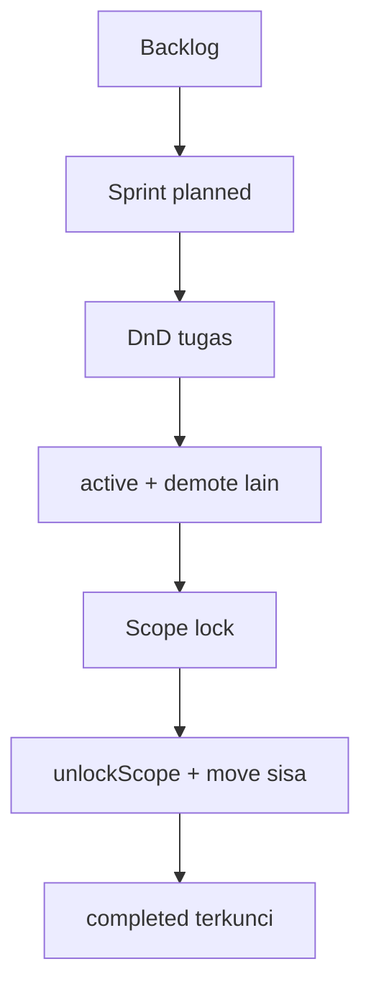

---

## 9.6 Papan Kanban

**Bisnis.** Visualisasi alur status kerja harian; WIP lunak sebagai sinyal overload (#455); blocker mencegah Done.

**Fungsional.** Kolom dari MasterData status; DnD; WIP badge; Socket.IO refresh.

**Teknis.** `src/features/kanban/` · PUT task status · normalisasi code case-insensitive (#459).

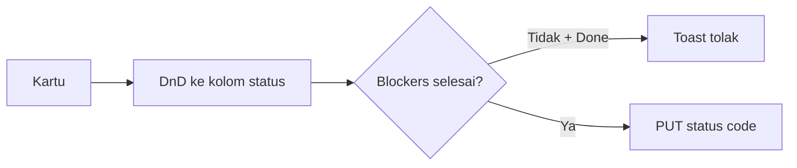

---

## 9.7 Timeline / Roadmap / Milestone

**Bisnis.** Perencanaan berbasis tanggal & milestone — permukaan utama Waterfall; tetap ada di Agile sebagai Roadmap & Timeline.

**Fungsional.** CRUD milestone, taut tugas (`milestoneId`), Gantt, garis dependensi `blocks` (#457). Bukan CPM.

**Teknis.** `src/features/timeline/` · `milestones.routes.ts` · label sidebar via `alurMetodologi` (#465).

```mermaid
flowchart TD
  WF[Proyek] --> TL[Timeline]
  TL --> MS[CRUD milestones]
  MS --> Link[Assign milestoneId]
  Link --> Gantt[Gantt + edges blocks]
```

---

## 9.8 QA

**Bisnis.** Suite uji → eksekusi → gagal menjadi bug yang dilacak sebagai Task agar Dev/QA satu rantai.

**Fungsional.** Suite/case CRUD, eksekusi Pass/Fail/…, history, generate AI (opsional), create bug Task, retest.

**Teknis.** `src/features/qa/` · `qa.routes.ts` · `linkedTaskId` + `linkedBugKey` (#463).

```mermaid
flowchart TD
  Suite --> Case
  Case --> Exec[Eksekusi]
  Exec -->|FAIL| Bug[Create Task bug]
  Bug --> FK[linkedTaskId + linkedBugKey]
  FK --> Dev[Dev di Board/List]
  Dev --> Retest[QA retest]
```

**RBAC:** peran `qa` = CRUD modul `qa`.

---

## 9.9 Wiki (Dokumentasi)

**Bisnis.** Basis pengetahuan proyek; System Analyst pemilik domain CRUD.

**Fungsional.** CRUD dokumen (teks/file/link), download, hard delete, sanitasi teks (#348).

**Teknis.** `src/features/wiki/` · `documents.routes.ts` dengan guard modul **`wiki`**.

```mermaid
flowchart LR
  List[Wiki list] --> Create[POST document]
  Create --> Edit[PUT content/file]
  Edit --> DL[Download]
  Edit --> Del[DELETE hard]
```

---

## 9.10 Flowchart

**Bisnis.** Diagram alur requirement/proses; System Analyst pemilik CRUD.

**Fungsional.** Buat diagram, edit nodes/edges, import, simpan `canvasData` JSON (#136), hapus.

**Teknis.** `src/features/flowchart/` · penyimpanan lewat Documents API (`type: flowchart`).  
**Catatan teknis (utang):** UI matriks memakai modul `flowchart`; guard server dokumen saat ini berkunci ke `wiki`. Perilaku efektif: SA tetap lolos CRUD dokumen; pemisahan guard flowchart vs wiki belum sempurna di API.

```mermaid
flowchart TD
  Dash[Flowchart dashboard] --> New[POST type=flowchart]
  New --> Canvas[Edit nodes/edges]
  Canvas --> Save[PUT canvasData]
  Save --> Del[DELETE]
```

---

## 9.11 Tim / Access

**Bisnis.** Siapa anggota proyek dan peran apa — mengunci seluruh matriks modul.

**Fungsional.** Invite, ubah role (code MasterData `project_role`), hapus anggota.

**Teknis.** `src/features/team/` · members/invites di `project.routes.ts` · modul matriks `access`.

```mermaid
flowchart TD
  Team[Panel Tim] --> Invite
  Invite --> Role[Set ProjectMembers.role code]
  Role --> Matrix[jagaProyek enforce matriks]
```

---

## 9.12 Administrasi sistem

| Submodul    | Bisnis                                | UI                          | API                                   |
| ----------- | ------------------------------------- | --------------------------- | ------------------------------------- |
| Master Data | Katalog status/peran/dept/methodology | `features/master`           | `master-data.routes.ts`               |
| Users       | Approve, CRUD user, sesi              | `features/users`            | `user.routes.ts`, `session.routes.ts` |
| Audit       | Jejak immutable                       | `features/enterprise-audit` | `audit.routes.ts`                     |
| Settings    | Email/WA/sistem                       | `features/settings`         | `system.routes.ts`                    |
| DB Explorer | Baca skema/SQL admin                  | `features/explorer`         | `db-admin.routes.ts`                  |

```mermaid
flowchart TD
  SysAdmin[Users.role=admin] --> MD[Master Data]
  SysAdmin --> US[Users + sessions]
  SysAdmin --> AU[Audit]
  SysAdmin --> ST[Settings]
  SysAdmin --> DB[DB Explorer]
  Head[head sistem] --> R[Read-only admin surfaces]
```

---

## 9.13 Catatan Rapat (modul induk Meeting AI)

**Bisnis.** BA mengelola notulen; poin diskusi; AI mengubah rekaman/teks → ringkasan terstruktur. Detail pipeline: **§10**.

**Fungsional.** CRUD meeting, discussion points + komentar, AI companion (live/upload/paste), unduh lampiran.

**Teknis.** `src/features/meeting-notes/` · `meetings.routes.ts` · `discussion-points.routes.ts`. List **tidak** boleh import berat FFmpeg (#460).

---

# 10. Meeting AI — spesifikasi dalam

## 10.1 BRD Meeting AI

| Aspek              | Isi                                                                                          |
| ------------------ | -------------------------------------------------------------------------------------------- |
| **Nilai bisnis**   | Mengurangi waktu BA menulis notulen; mengekstrak keputusan/action item dari audio/video/teks |
| **Pengguna utama** | `business_analyst` (CRUD); owner/admin/manager CRUD; SA/qa CRU; dev/head/viewer R            |
| **Input**          | (1) rekam live mic (2) unggah audio/video ≤120MB (3) paste / `.txt` manuscript               |
| **Output**         | Transcript + `aiSummary` terstruktur; file rekaman **dihapus** setelah sukses                |
| **Bukan janji**    | Parity Otter (diarization speaker belum); SLA waktu real-time tetap                          |
| **Status produk**  | Kode gelombang 1 + hardening ada; **E2E COMPLETED pemilik = #320 BELUM**                     |

## 10.2 FSD — tiga jalur input

| Jalur      | Langkah pengguna                                           | Hasil                                      |
| ---------- | ---------------------------------------------------------- | ------------------------------------------ |
| Live       | Buka detail → AiMeetingCompanion → rekam ≥5s ≥1KB → proses | Pipeline async                             |
| Upload     | Pilih media → (opsional) FFmpeg.wasm → MP3 → chunk upload  | Pipeline auto-start                        |
| Manuscript | Paste / `.txt` ≤5MB                                        | `analyze-transcript` sync (tanpa STT file) |

**Poin diskusi:** CRUD terpisah; authorId dari JWT (#251). Hapus meeting cascade points + file (#444).

**Aturan ekstra:** PUT/DELETE meeting hanya **author atau system ADMIN** (ketat vs matriks U/D).

## 10.3 TSD — komponen & API

| Lapisan                | Path                                                   |
| ---------------------- | ------------------------------------------------------ |
| List shell             | `MeetingNotes.tsx`                                     |
| Detail + points        | `DiscussionPointsTable.tsx` (lazy #460)                |
| AI UI                  | `AiMeetingCompanion.tsx`                               |
| Live helpers           | `lib/liveRecording.ts`                                 |
| Pipeline server        | `server/services/meeting.service.ts` (`runAIPipeline`) |
| Transcode              | `server/services/meeting-transcode.ts`                 |
| Filter anti-halusinasi | `server/services/meeting-ai-filter.ts`                 |
| Gemini wrapper         | `server/services/ai.service.ts`                        |

### API utama

| Method | Path                                    | Guard          | Catatan                               |
| ------ | --------------------------------------- | -------------- | ------------------------------------- |
| POST   | `/api/v1/meetings/:id/upload-recording` | meetingNotes U | Chunk merge; **auto** `runAIPipeline` |
| GET    | `/api/v1/meetings/:id/status`           | R              | Poll progress                         |
| POST   | `/api/v1/meetings/:id/cancel`           | U              | Hapus file → IDLE                     |
| POST   | `/api/v1/meetings/:id/analyze`          | U              | Manual 202 (jarang dipakai UI)        |
| POST   | `.../analyze-transcript`                | U              | Paste path                            |
| POST   | `.../analyze-video`                     | U              | Multimodal 2.5 Pro (UI belum panggil) |
| CRUD   | `/api/projects/:pid/meetings`           | C/R/U/D        | + discussion points                   |

### Env & dependensi

| Var / dep                    | Fungsi                                        |
| ---------------------------- | --------------------------------------------- |
| `GEMINI_API_KEY`             | STT + LLM                                     |
| `AI_PIPELINE_MAX_CONCURRENT` | Default 2 (clamp 1–4), in-process (#322)      |
| `ffmpeg` di PATH             | Transcode server                              |
| Disk `uploads/`              | Rekaman lokal — **bukan** `STORAGE_DRIVER` S3 |

## 10.4 State machine pipeline

```mermaid
stateDiagram-v2
  [*] --> IDLE
  IDLE --> UPLOAD_SUCCESS: upload selesai
  UPLOAD_SUCCESS --> EXTRACTING_AUDIO: ~15%
  EXTRACTING_AUDIO --> TRANSCRIBING_STT: ~60%
  TRANSCRIBING_STT --> ANALYZING_LLM: ~90%
  ANALYZING_LLM --> COMPLETED: hapus file disk
  ANALYZING_LLM --> FAILED: file dipertahankan
  IDLE --> IDLE: cancel
  EXTRACTING_AUDIO --> IDLE: cancel
  TRANSCRIBING_STT --> IDLE: cancel
  ANALYZING_LLM --> IDLE: cancel
```

Alias legacy: `PROCESSING_AI` → dipetakan ke EXTRACTING_AUDIO di GET status; `TRANSCRIBING` → TRANSCRIBING_STT.

## 10.5 Swimlane end-to-end (live/upload)

```mermaid
sequenceDiagram
  participant BA as BA / User
  participant UI as AiMeetingCompanion
  participant FE as FFmpeg.wasm
  participant API as meetings.routes
  participant Pipe as runAIPipeline
  participant FF as FFmpeg CLI
  participant G as Gemini
  participant DB as PostgreSQL
  participant Disk as uploads/

  BA->>UI: Rekam / pilih file
  UI->>FE: Transcode MP3 (best effort)
  FE-->>UI: MP3 atau raw fallback #447
  UI->>API: POST upload-recording chunks
  API->>Disk: merge file
  API->>DB: UPLOAD_SUCCESS + recording_url
  API->>Pipe: fire-and-forget
  Pipe->>FF: extract audio MP3
  Pipe->>DB: EXTRACTING_AUDIO
  Pipe->>G: STT
  Pipe->>DB: TRANSCRIBING_STT
  Pipe->>G: structured LLM
  Pipe->>DB: ANALYZING_LLM → COMPLETED + aiSummary
  Pipe->>Disk: delete recording
  Pipe-->>UI: Socket meeting_ai_completed / poll status
  BA->>UI: Baca ringkasan + transcript
```

## 10.6 Swimlane manuscript (paste)

```mermaid
sequenceDiagram
  participant BA as BA
  participant UI as UI
  participant API as analyze-transcript
  participant G as Gemini flash
  participant DB as DB
  BA->>UI: Paste / .txt
  UI->>API: POST analyze-transcript
  API->>G: analisis + filter UNVERIFIED
  API->>DB: transcript + aiSummary
  API-->>UI: hasil sync
```

## 10.7 Progress & kegagalan

- Socket: `meeting_ai_status`, `meeting_ai_completed`, `meeting_ai_failed`
- Fallback poll 3s pada `/status` setelah upload yang memulai pipeline
- Cancel: hapus disk dulu, lalu `IDLE` (#441) — pipeline berhenti antar tahap
- FAILED: file tetap untuk retry
- COMPLETED: file dihapus (retensi #320)

## 10.8 Gap & risiko (#320)

| Gap                           | Dampak                                   |
| ----------------------------- | ---------------------------------------- |
| E2E pemilik belum COMPLETED   | Jangan klaim production-ready Meeting AI |
| Tanpa diarization             | Speaker tidak terpisah                   |
| Disk lokal / Vercel ephemeral | Benturan #30                             |
| Semaphore in-process saja     | Bukan antrian durable multi-instance     |
| `analyze-video` belum di UI   | Kapabilitas server idle                  |

---

# 11. Auth & OIDC — spesifikasi dalam

## 11.1 BRD Auth

| Aspek          | Isi                                                                     |
| -------------- | ----------------------------------------------------------------------- |
| **Tujuan**     | Identitas terpercaya sebelum akses proyek                               |
| **Saluran**    | Email+password · Google OIDC · Microsoft OIDC (`bni.co.id` target #305) |
| **Onboarding** | Self-register → pending → admin approve → email aktif (#261 terkait)    |
| **Pemulihan**  | Forgot → kata sandi sementara berbatas waktu → wajib ganti              |

## 11.2 FSD Auth

1. Register → `pending`
2. Admin set `approved`/`active`/`rejected`
3. Login password ATAU SSO
4. SSO user baru → lengkapi pendaftaran bila perlu
5. Forgot password → email → login temp → force change
6. Logout → blacklist JWT

## 11.3 TSD Auth

| Area         | Path                                                                                      |
| ------------ | ----------------------------------------------------------------------------------------- |
| UI           | `src/features/auth/` (`LoginScreen`, `RegisterScreen`, `SsoButtons`, forgot/reset modals) |
| Password API | `server/routes/auth.routes.ts`                                                            |
| OIDC API     | `server/routes/auth-oidc.routes.ts`                                                       |
| Adaptor      | `server/services/oidc.service.ts` (discovery Microsoft/Google)                            |
| Approve      | `server/routes/user.routes.ts`                                                            |

### OIDC flow

```mermaid
sequenceDiagram
  participant U as User
  participant FE as SsoButtons
  participant API as auth-oidc
  participant IdP as Google/Microsoft
  U->>FE: Klik provider
  FE->>API: GET /:provider/start
  API-->>U: Redirect IdP
  U->>IdP: Login consent
  IdP->>API: callback + code
  API->>IdP: token + claims
  API->>API: upsert/link user
  API-->>FE: sso_token / session
  Note over API,FE: Microsoft: OIDC_MICROSOFT_* + tenant (#305 verifikasi lapangan)
```

### Password forgot (ringkas terkini)

```mermaid
flowchart TD
  A[Forgot password] --> B[Email terdaftar?]
  B -->|Tidak| C[404 email_tidak_terdaftar]
  B -->|Ya| D[Set passwordHash sementara + blacklist sesi]
  D --> E[Email kata sandi temp 2 jam]
  E --> F[Login → wajib ganti sandi]
```

## 11.4 Gap Auth

| Gap                                             | Tiket                |
| ----------------------------------------------- | -------------------- |
| Verifikasi login Microsoft sungguhan domain BNI | #305                 |
| Arah httpOnly cookie vs localStorage JWT        | terkait #30 keamanan |

---

# 12. Lampiran

## 12.1 Artefak terkait

| Artefak             | Path                                       |
| ------------------- | ------------------------------------------ |
| Skema DB            | `docs/DATABASE_SCHEMA.md`                  |
| API                 | `docs/API-SURFACE.md`, `docs/openapi.json` |
| Keamanan            | `docs/security_spec.md`                    |
| Papan               | `AUDIT.md` §1, §19, §24                    |
| Aturan agen         | `AGENTS.md`                                |
| PDF DRAFT           | `docs/LanPro-BRD-FSD-TSD-v3.1.pdf`         |
| HTML (sumber cetak) | `docs/LanPro-BRD-FSD-TSD-v3.1.html`        |

## 12.2 Yang dokumen ini bukan

- Bukan kontrak hukum / SLA pelanggan.
- Bukan OpenAPI penuh setiap rute.
- Bukan janji fitur out-of-scope (#346) atau parity Otter.

## 12.3 Riwayat versi

| Ver     | Tanggal         | Perubahan                                                               |
| ------- | --------------- | ----------------------------------------------------------------------- |
| 2.5     | sebelumnya      | Draft enterprise; RBAC satu tingkat — **basi**                          |
| 3.0     | 06 Sep 2026     | Two-Tier RBAC, dual-mode, flowchart per role                            |
| **3.1** | **06 Sep 2026** | Per modul BRD+FSD+TSD+swimlane; Meeting AI dalam; Auth/OIDC dalam; #466 |

## 12.4 Keputusan review tersisa

1. Apakah utang guard Flowchart=`wiki` di API perlu tiket baru (mis. #467)?
2. Setelah review teks: cabut watermark DRAFT pada PDF berikutnya?
3. Tutup formal #466 di papan setelah Anda setujui isi?

---

_Akhir dokumen v3.1.0 — siap review pemilik · tiket #466._
